# Viadrina Library Assistant 🤖📚

An AI-powered Streamlit app using OpenAI Responses API. It answers domain-specific questions with Retrieval-Augmented Generation (RAG), web search, mcp support, and rich citations. Includes an admin UI for settings, prompt versioning, tools, analytics, and scraping/vectorization workflows.

It can index any set of websites or internal documents to build a knowledge base for RAG.

Use the app for research assistance, document discovery, or general Q&A over custom corpora. Feel free to use it as a starting point for building your own AI chat assistant with Streamlit and OpenAI.


## 🌐 Live Demo

Try it: https://viadrina.streamlit.app

(This demo is slowed by free-tier hosting and may take a while to respond.)

## Architecture

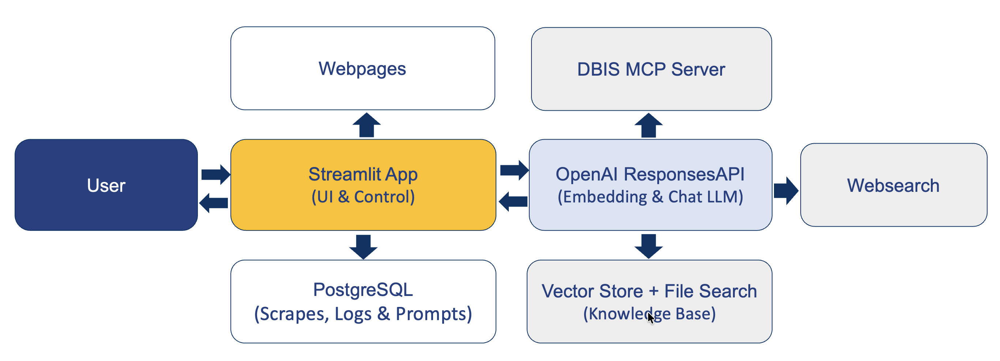

## ✨ Highlights

- **Multilingual chat assistant** with streaming Responses API output, status updates, and resilient error handling.
- **Retrieval-Augmented Generation** backed by the documents knowledge base (PostgreSQL + OpenAI File Search) with inline citations.
- **One-click document viewer** that opens cited internal markdown in a dedicated Streamlit tab (no more losing context).
- **Web search tooling** with admin-managed allow lists, locale/user-location overrides, and per-request cost estimates.
- **Admin control center** covering prompt versioning, LLM settings, request classifications, web search filters, and knowledge-base maintenance.
- **Content ingestion pipeline** with scraping, manual metadata editing, SHA hashing, and optional vector store sync.
- **Observability out of the box**: detailed interaction logging, usage/cost tracking, request analytics, and job locking.
- **Live DBIS lookup** via Model Context Protocol (MCP) tools so the assistant can fetch authoritative database information directly from the DBIS API with clear in-chat indicators.
- **Downloadable transcripts**: export any chat as Markdown with automatic footnote-style references for cited sources.

## 📸  Screenshots

### Main Chat Interface

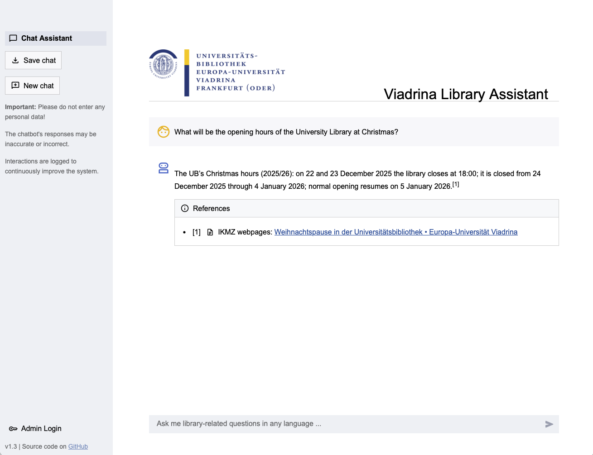

### Logging and Analytics Dashboard

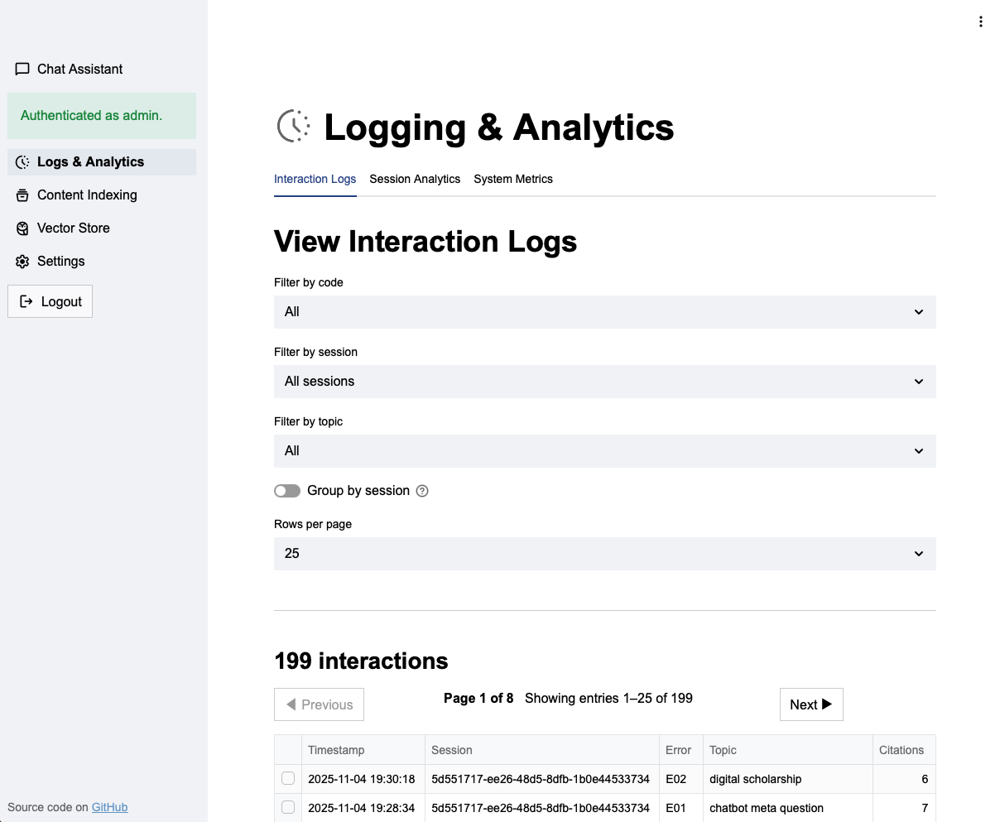

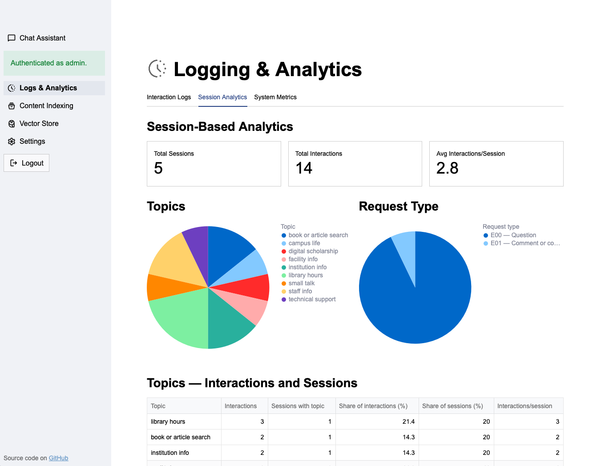

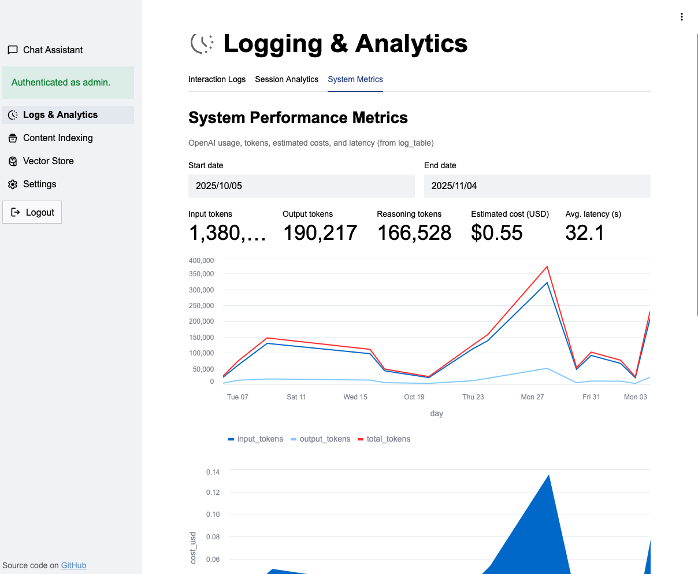

### Content Indexing

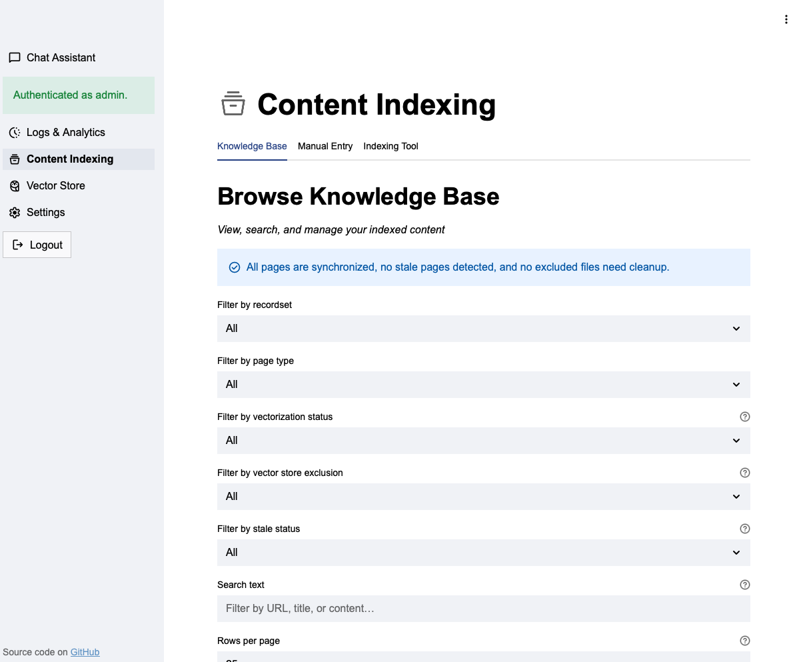

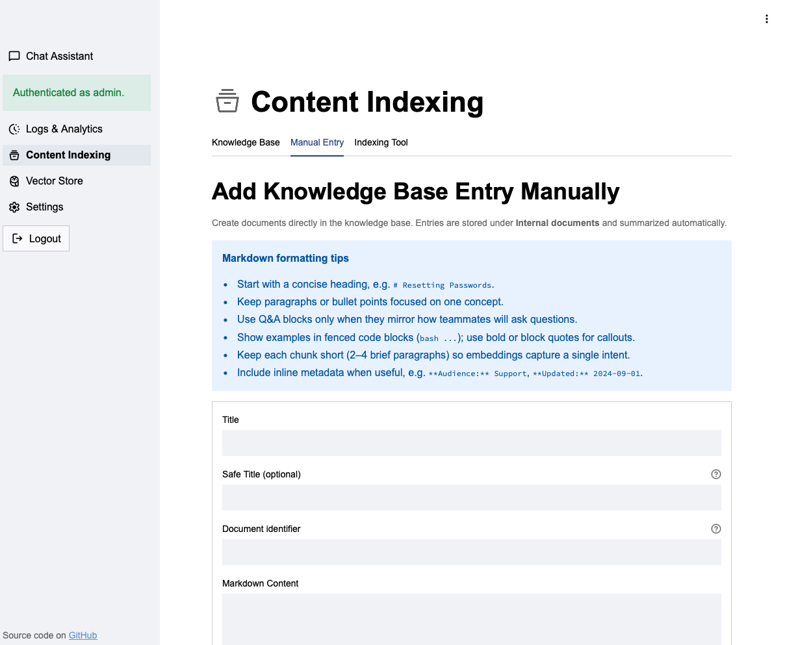

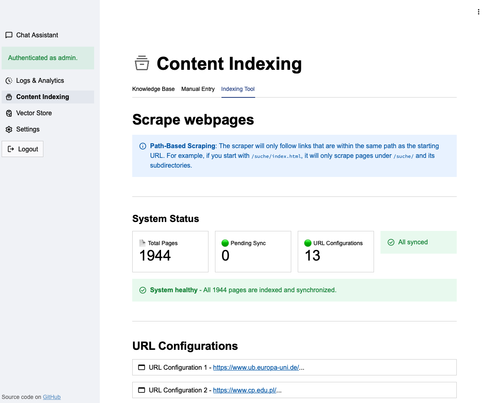

### Vector Store Management

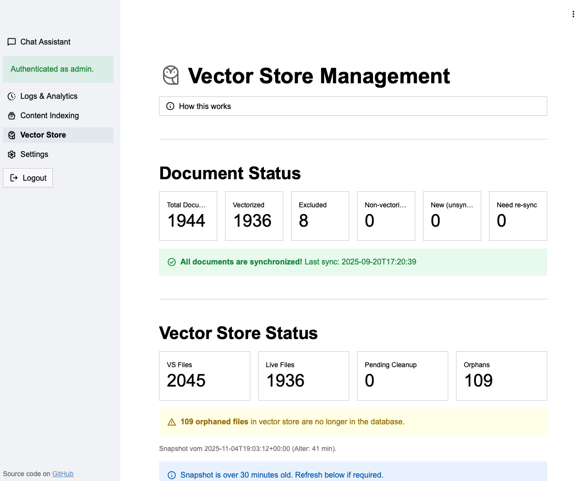

### Settings Section

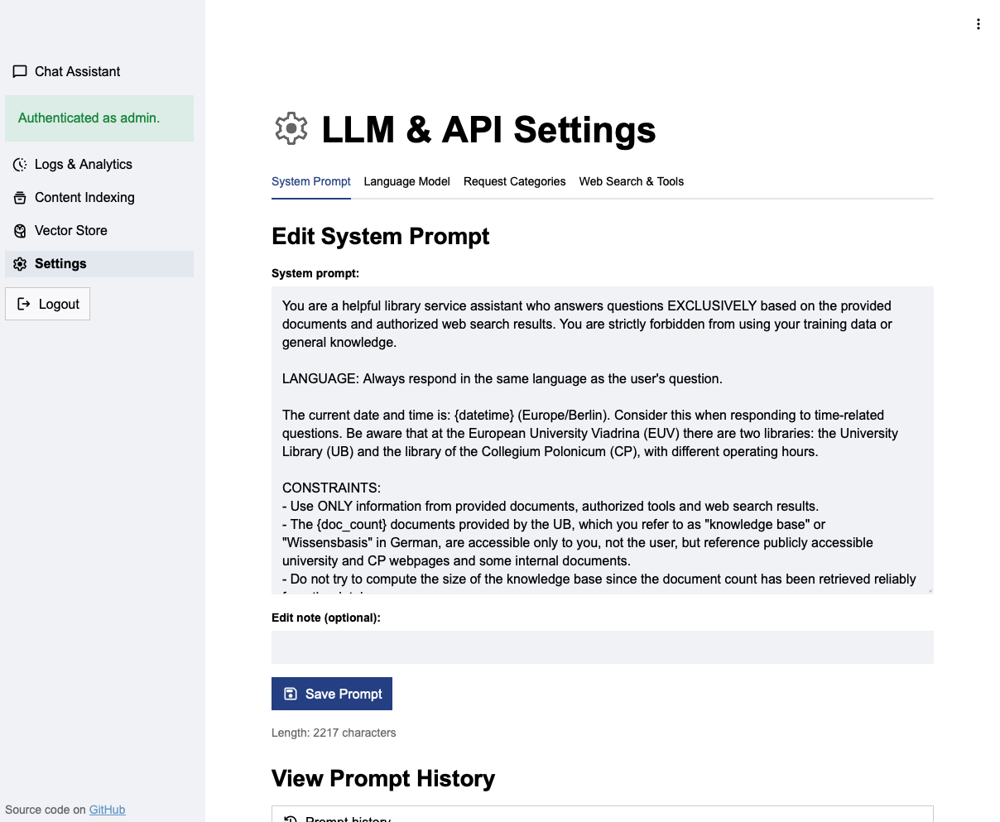

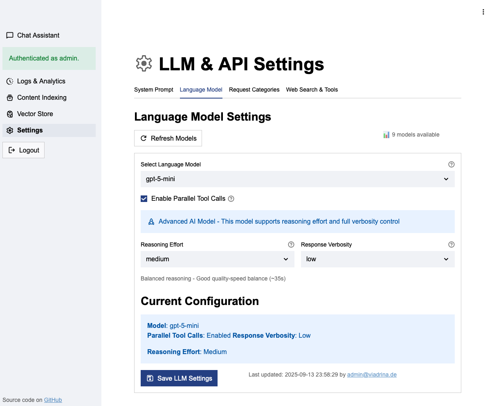

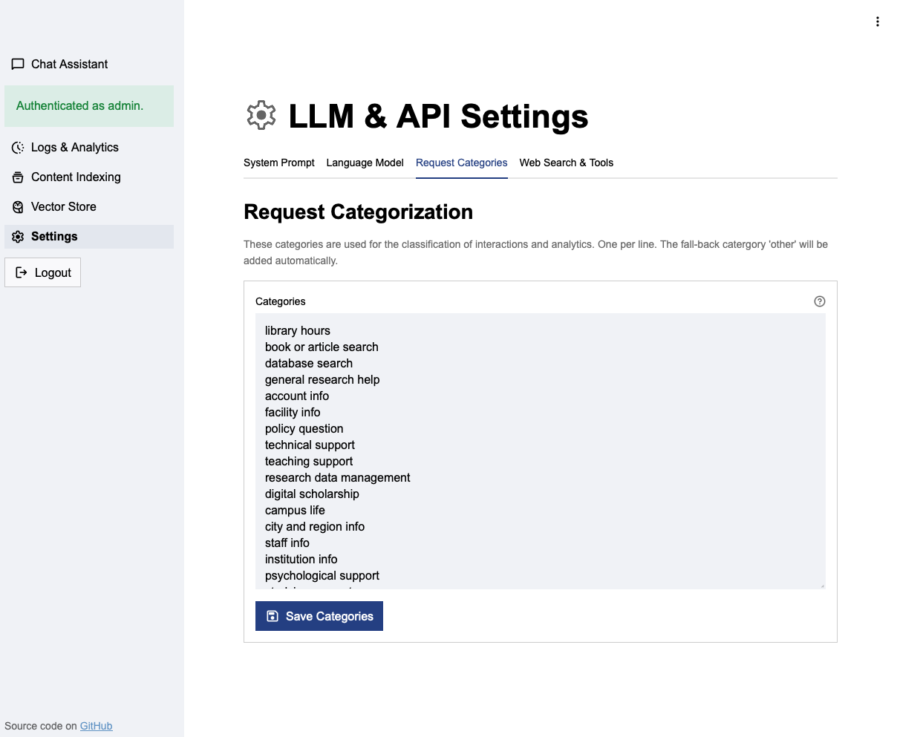

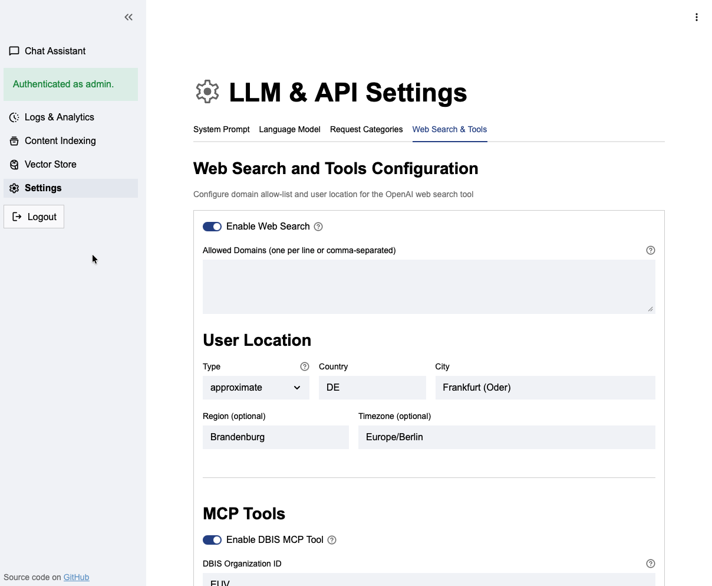

## 🆕 What’s New (recent changes)

- Switched the admin login flow to use Streamlit's native OIDC support (`st.login()`, `st.logout()`, `st.user`) with email allowlists
- Streamlit now launches scraping/vectorization runs via the CLI helper so heavy OpenAI work happens out-of-process while the UI stays responsive
- Web search filters, MCP tools, and request classifications remain editable from the admin pages
- Web search settings moved to Admin → Filters:
  - Allowed Domains (optional): restrict web search to these domains when set; if empty, web search is unrestricted
  - User Location: type (approximate/precise), country, city, region (optional), timezone (optional)
  - Note: The API does not support exclude-only lists or a locale filter
- Request Classifications are now DB-backed and editable in Admin → Request Classes
- Client-managed conversation context retained for predictability (see Context section)
- Internal document citations now open in a dedicated `/document_viewer` tab so users can view internal knowledge base sources
- Added manual entries to the knowledge base as internal documents, made them editable
- DBIS database records are now reachable through MCP tools; configure once and the chatbot can query subjects or resources in real time (see *DBIS MCP Integration* below)
- Sidebar **Save chat** button exports the current conversation (including citations) as Markdown for easy sharing or archiving


## 🚀 Quick Start

### Prerequisites
- Python 3.9+
- OpenAI API key
- PostgreSQL (for logging/admin features)

### Install (recommended virtual environment)

```bash
python3 -m venv .venv  # use `python` if it maps to Python 3
source .venv/bin/activate  # Windows: .venv\Scripts\activate
pip install -r requirements.txt
```

### Configure secrets
Copy the example secrets file and fill in your values:

```bash
cp .streamlit/secrets.toml.example .streamlit/secrets.toml
```

Edit `.streamlit/secrets.toml`:

```toml
OPENAI_API_KEY = "your-openai-api-key"
VECTOR_STORE_ID = "your-vector-store-id"
ADMIN_PASSWORD = "your-admin-password"
# Optional: default model (used only if DB LLM settings unavailable)
MODEL = "gpt-4o-mini"
# Optional: shown as default in Admin UI and for auditing
ADMIN_EMAIL = "you@your.org"
# Optional: DBIS integration (MCP)
DBIS_MCP_SERVER_URL = "https://example.app/mcp"
DBIS_MCP_AUTHORIZATION = "Bearer <token>"           # optional, if your MCP server needs auth
DBIS_MCP_HEADERS = '{"X-Org": "123"}'              # optional extra headers as JSON

[postgres]
host = "your-host"   # optional (when omitted, app runs in reduced mode)
port = 5432
user = "your-user"
password = "your-password"
database = "chatbot_db"
```

Run:
```bash
streamlit run app.py
```

### Container Deploy (Docker or Podman)

We ship a `docker-compose.yaml` that runs two core services (plus an optional watchdog):

- `chatbot`: the Streamlit UI (builds the local app and exposes `8501`)
- `cli-runner`: an on-demand helper container for heavy scraping/vectorization runs; invoke it with `docker compose run --rm --profile cli cli-runner --mode vectorize` (or `sync`/`all`/`cleanup`) so the job happens outside the UI process while still sharing secrets/state
- `autoheal`: optional watchdog that restarts unhealthy containers

1. **Prepare host directories**: The container runs as a non-root user. Ensure the mounted directories exist and are writable:
   ```bash
   # As the user that will run the container (e.g., 'chatbot'):
   mkdir -p /home/chatbot/app/.streamlit /home/chatbot/app/state /home/chatbot/app/logs
   # If directories already exist but are owned by root:
   sudo chown -R chatbot:chatbot /home/chatbot/app/state /home/chatbot/app/logs
   ```

2. Build the image (Docker or Podman both work):
   ```bash
   docker build -t chatbot .
   # or: podman build --format docker -t chatbot .
   ```
3. Start everything:
   ```bash
   docker compose up --build -d      # podman-compose up --build -d
   # or, if you wrapped compose in systemd: systemctl restart chatbot
   ```

4. Run a one-off scraping/vectorization job in its own container (keeps Streamlit responsive even with large vector stores):
   ```bash
   docker compose run --rm --profile cli cli-runner --mode all         # scrape + vectorize + orphan cleanup
   docker compose run --rm --profile cli cli-runner --mode vectorize   # vectorize only
   docker compose run --rm --profile cli cli-runner --mode sync        # scrape + vectorize (skip cleanup)
   docker compose run --rm --profile cli cli-runner --mode scrape -- --budget 2000
   docker compose run --rm --profile cli cli-runner --mode cleanup     # purge orphaned vector files only
   ```
   Arguments passed after `--` are forwarded to `scripts/cli_scrape.py`. The helper shares the same `.streamlit` and `state` mounts, so files such as `state/vector_store_details.json` and `last_vector_sync.txt` stay in sync with the UI container.

### Scheduling scraper/vectorizer runs outside the UI container

Configure daily start times (e.g., `06:30`, `12:00`, `23:45`) plus fallback interval/mode/crawl-budget/dry-run values from **Admin → Scraping → Scheduled CLI runner**. Mode `sync` runs scraping + vectorization without cleanup, `all` adds the orphan cleanup step, and `cleanup` runs just the purge. The UI persists everything to `state/scraper_schedule.json`, which the helper script `scripts/run_cli_if_due.py` reads before deciding whether the next slot has arrived.

Trigger the helper with whichever scheduler matches your deployment:

1. **systemd timer (Docker Compose, recommended)**  
   `/etc/systemd/system/cli-runner.service`:
   ```
   [Unit]
   Description=AI Service CLI runner (Docker)
   WorkingDirectory=/home/chatbot/app

   [Service]
   Type=oneshot
   ExecStart=/usr/bin/docker compose run --rm --profile cli --entrypoint python cli-runner scripts/run_cli_if_due.py
   ```
   `/etc/systemd/system/cli-runner.timer`:
   ```
   [Unit]
   Description=Trigger AI Service CLI runner every 15 minutes

   [Timer]
   OnBootSec=2min
   OnUnitActiveSec=15min
   Persistent=true

   [Install]
   WantedBy=timers.target
   ```
   Enable with `systemctl enable --now cli-runner.timer`. The helper exits immediately when the next configured HH:MM hasn’t arrived; when due, it launches `scripts/cli_scrape.py` inside the `cli-runner` container and updates `state/scraper_schedule.json`.

2. **systemd timer (Podman Compose)**  
   Same timer definition as above, but set `ExecStart=/usr/bin/podman-compose run --rm --profile cli --entrypoint python cli-runner scripts/run_cli_if_due.py`.

3. **systemd timer (bare Python install)**  
   Point the service to your virtual environment instead of Compose:
   ```
   ExecStart=/home/chatbot/app/.venv/bin/python /home/chatbot/app/scripts/run_cli_if_due.py
   WorkingDirectory=/home/chatbot/app
   ```
   Make sure the service account can read `.streamlit/secrets.toml` and `state/`.

4. **cron fallback** (evaluate every 15 minutes):
   ```
   */15 * * * * cd /home/chatbot/app && docker compose run --rm --profile cli --entrypoint python cli-runner scripts/run_cli_if_due.py >> /var/log/cli-runner.log 2>&1
   ```
   Replace the command with `podman-compose …` or `~/.venv/bin/python scripts/run_cli_if_due.py` if you aren’t using containers.

All of these reuse the shared `.streamlit` and `state` volumes/directories, so the Streamlit UI immediately sees `state/vector_store_details.json`, `last_vector_sync.txt`, scheduler metadata, and dirty-flag markers written by the job.

## 🔌 DBIS MCP Integration

The chatbot can consult DBIS (Database Information System) through a lightweight MCP server included in this repo (`mcp_servers/dbis/server.py`).

1. **Install dependencies** (already in `requirements.txt`): `pip install fastmcp httpx`.
2. **Expose the MCP server command**
   - For local runs: `export OPENAI_MCP_SERVER_DBIS="python mcp_servers/dbis/server.py"` before launching Streamlit.
   - For Streamlit Cloud, place the same line in `secrets.toml` (as shown above).

During a chat turn the UI displays “Tool use…” whenever the model actually called one of the DBIS tools.

## 🔧 Configuration Notes

### Admin Login (OpenID Connect)
- By default the admin pages accept a single password stored in `ADMIN_PASSWORD`.
- To enable multi-user SSO, add an `[auth]` block to `.streamlit/secrets.toml` with your provider details. This uses Streamlit's native OIDC support (`st.login()`, `st.logout()`, `st.user`):
  ```toml
  [auth]
  redirect_uri = "https://your-app.example.com/oauth2callback"  # must match value registered with IdP
  cookie_secret = "your-random-secret-string"                   # generate a strong random secret
  client_id = "your-client-id"
  client_secret = "your-client-secret"
  server_metadata_url = "https://idp.example.com/.well-known/openid-configuration"
  
  # Optional: restrict admin access to specific emails
  allowlist = ["librarian@example.com", "it@example.com"]
  # Optional: enable password fallback for emergencies
  allow_password_fallback = false
  ```
- For **named providers** (e.g., if you want to label the button "Google" or "Microsoft"):
  ```toml
  [auth]
  redirect_uri = "https://your-app.example.com/oauth2callback"
  cookie_secret = "your-random-secret-string"
  allowlist = ["librarian@example.com"]
  
  [auth.microsoft]
  client_id = "your-client-id"
  client_secret = "your-client-secret"
  server_metadata_url = "https://login.microsoftonline.com/{tenant}/v2.0/.well-known/openid-configuration"
  ```
- Streamlit handles the OAuth2 flow with PKCE automatically. User info is available via `st.user.email`, `st.user.name`, etc.
- Only users whose email appears in `allowlist` gain admin access; omit the list to allow any authenticated user.
- **Note**: Requires `streamlit[auth]` (includes `authlib>=1.3.2`). The identity cookie expires after 30 days.

### Web Search & Tools (Admin → Settings)
- Allowed Domains (optional)
  - Provide one or more domains (e.g., `arXiv.org`) to restrict search
  - If the list is empty, the app sends no filters and web search runs unrestricted (when enabled)
- User Location (optional fields)
  - type: `approximate` or `precise`
  - country: ISO 3166-1 alpha-2 (e.g., `DE`, `US`)
  - city: free text (e.g., `Frankfurt (Oder)`, `New York`)
  - region: free text
  - timezone: IANA name (e.g., `Europe/Berlin`, `America/New_York`)
- MCP
  - DBIS Organization ID
  - Needed for lookup of resources and subjects associated with your institution

Example tool payload the app generates (simplified):
```json
{
  "type": "web_search",
  "filters": {
    "allowed_domains": ["arXiv.org", "jstor.org", "data.europa.eu", "harvard.edu"]
  },
  "user_location": {
    "type": "approximate",
    "country": "DE",
    "city": "Frankfurt (Oder)",
    "region": "Brandenburg",
    "timezone": "Europe/Berlin"
  }
}
```

### Request Classifications (Admin → Request Classes)
- Categories are stored in PostgreSQL (`request_classifications` table)
- The UI ensures `other` is always present; you can edit the list freely

### LLM Settings (Admin → Language Model)
- Model, parallel tool calls, optional reasoning effort/verbosity (if supported)
- Settings are persisted in PostgreSQL (`llm_settings` table)

## 💬 Context & Conversations

This app currently uses client-managed context for reliability and control:
- On each turn we send the system prompt + the last N turns of history + the new user message
- This keeps responses deterministic and makes trimming explicit
- Responses API returns `conversation: null` because server-side conversations are not used

If you want to switch to OpenAI-managed conversations later:
- Create a conversation once, store `conversation_id` in session state
- Pass `conversation = conversation_id` on each call and only send the new user message
- Widen DB columns if you want to store the OpenAI conversation ID (longer than UUID-36)

## 📚 Features Overview

- Streaming responses with readable statuses ("Searching the web…", etc.)
- RAG with File Search: vector store-backed citations with hover tooltips
- Dedicated `document_viewer` page for browsing cited markdown with summaries, tags, and back-link
- Admin: scraping, vectorization, prompt versioning, filters, logs/analytics
- Session tracking: UUID-based sessions with costs/usage/latency logging
- Robust error handling and graceful degradation without DB

## 🗃️ Database

- Auto-creates tables on first run when `[postgres]` secrets are present and accessible
- Key tables:
  - `log_table`: full interaction logs (session_id, citations, costs, latency, etc.)
  - `prompt_versions`: prompt history
  - `llm_settings`: model/configuration in DB
  - `filter_settings`: web_search enable flag, optional allowed domains, and user location
  - `request_classifications`: editable list of request classes

## 📦 Project Structure (short)

```
ai-service-chatbot/
├── app.py              # Main Streamlit app (chat)
├── pages/              # Admin + tools (scrape, vectorize, logs)
├── utils/              # DB and helper functions
├── css/, assets/       # UI assets
├── tests/              # Test suite
└── .streamlit/         # secrets.toml, prompts.json
```

## 🌐 Deployment (Streamlit Cloud)

- Push to GitHub → Deploy on Streamlit Cloud
- Add your `.streamlit/secrets.toml` in app settings
- For DB-backed features, configure an external PostgreSQL (Neon, Supabase, etc.)

## 🧪 Tests

See `tests/` for examples covering filters, session handling, and UI behavior.

## 📝 License

MIT — see `LICENSE`.

## 🙋 Support

- Open a GitHub issue
- Streamlit docs: https://docs.streamlit.io/
- OpenAI docs: https://platform.openai.com/docs/

---

**Built with ❤️ for the Viadrina University Library**
